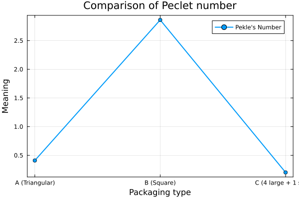
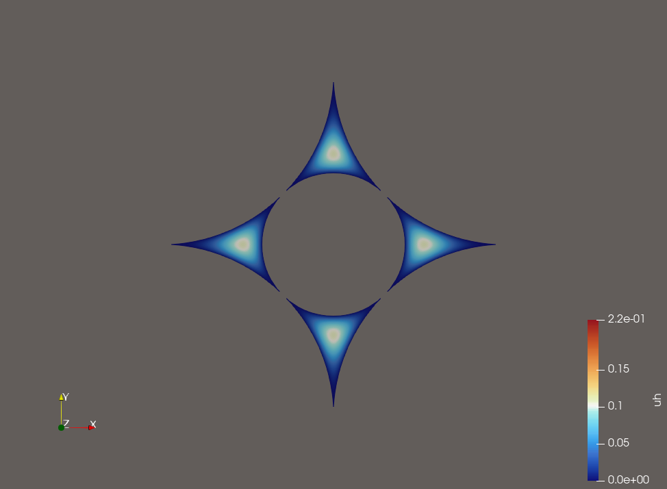

# Numerical Simulation of Microfluidic Configurations

This repository contains code for generating and analyzing different microfluidic channel configurations using GMSH for mesh generation and Gridap.jl for finite element analysis.

## Contents

- **Mesh Generation**: Python scripts using GMSH to create three different microfluidic configurations:
  - Configuration A: Triangular domain with circular cutouts at vertices
  - Configuration B: Square domain with circular cutouts at vertices
  - Configuration C: Square domain with circular cutouts at vertices and center

- **Flow Simulation**: Julia code using Gridap.jl to solve the flow equations and compute Peclet numbers for each configuration

## Files

- `generate_mesh.py`: Generates three mesh configurations (A, B, C) and saves them as `.msh` files
- `solve_dif_conduite.jl`: Solves the flow equations and computes Peclet numbers for each configuration, and saves them as VTK files with solution fields
- Visualizations:
  - `sol1.png`, `sol2.png`, `sol3.png`: Plot solution fields
  - `peclet_comparison.png`: Plot comparing Peclet numbers across configurations

## Results

The simulation computes and compares the following metrics for each configuration:

| Configuration | Type                  | Flow Rate (nm³/s) | Area (nm²)      | Avg Velocity (nm/s) | Peclet Number |
|--------------|-----------------------|------------------|-----------------|---------------------|---------------|
| A            | Triangular            | 5.466            | 64.502          | 0.0847              | 0.410         |
| B            | Square                | 202.967          | 343.364         | 0.5911              | 2.860         |
| C            | 4 large + 1 small     | 5.408            | 129.541         | 0.0417              | 0.202         |

Key observations:
- The square configuration (B) shows significantly higher flow rates and Peclet numbers
- The triangular (A) and complex square (C) configurations have similar flow characteristics
- Configuration C has the lowest Peclet number, indicating more diffusive-dominated transport





## Requirements

- Python 3 with GMSH library
- Julia with packages:
  - Gridap
  - GridapGmsh
  - Plots

## Usage

1. Generate meshes:
   ```bash
   python generate_mesh.py
   ```

2. Run simulations:
   ```bash
   julia solve_dif_conduite.jl
   ```

## License

[MIT License](LICENSE)
